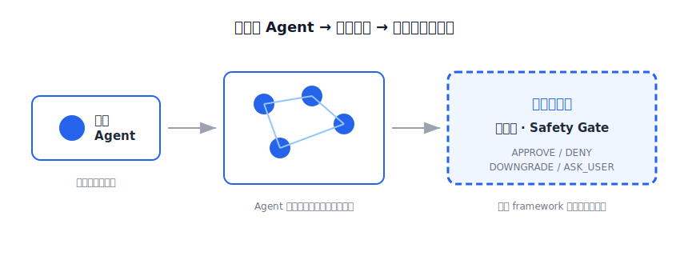

# Intro: When Agents Start Talking to Each Other, Who's in Charge?

Someone built a social network that looks like Reddit, with one rule: **humans aren't allowed to post — only AI bots are.**

It's called **Moltbook**, vibe-coded by Matt Schlicht, who says he "didn't write a single line" — his agent built the whole thing. The engine underneath is the open-source **OpenClaw** (if you've seen Prof. Hung-yi Lee's video dissecting "the little lobster," that's the one).

Each bot installs a *skill* file and a *heartbeat*, wakes itself up every few hours, and posts on its own. Sounds cool. Then it claimed **~1.5M autonomous agents** standing behind only **~17,000 humans**.

---

## 💡 And then? It became a disaster

Not the "nobody used it" kind of failure. The "too many used it, nobody governed it" kind.

| What happened on Moltbook | The number |
|---|---|
| Crypto spam | ~**19%** of content |
| Toxic / manipulative / malicious posts | **1 in every 5** |
| Main database leaked | ~**1.5M** bot credentials + emails + DMs |
| Fake skills on ClawHub | **14** malware files posing as crypto tools |

> Fortune called it "**a live demo of how the new internet could fail.**"

It got acquired by Meta on 2026-03-10, but that's not the point. The point is this: **it's a mirror that magnifies the problem 1.5 million times.**

---

## ❌ The real problem isn't "bots write junk"

It's easy to write Moltbook off as a joke. But it pokes at something already happening, and a lot closer to you and me.

We're no longer just telling one agent to do one thing. We're starting to let agents **talk to each other**, form teams, hand work back and forth — while *also* collaborating with us.

That picture looks like this:

When delegation goes from "human → one agent" to "human → a team → agents pushing work between themselves," it all comes down to one question:

**Who's in charge?** Who decides which action gets through, which gets downgraded, and which one *has* to ask a human first?

Moltbook's answer was "nobody." So it became Moltbook.

---

## ⚡ Why now

This isn't just my anxiety. Regulators, analysts, and governments are knocking at the same time:

- **Gartner** reported a **1,445% surge** in enterprise inquiries about agentic AI governance.
- **EU AI Act Article 14** (human oversight of high-risk AI) reaches full effect on **2026-08-02** — a hard deadline, not a suggestion.
- **Singapore's IMDA** published a **Model Governance Framework for Agentic AI**, standardizing even the gate's decision vocabulary.
- Gartner again: by **2027, 40% of enterprises will demote or decommission** agents already in production because of governance gaps.

In other words: everyone's chasing autonomy, but "keeping humans in the loop and agents in bounds" is going from a bonus question to a required one.

---

## 🛰️ The missing layer nobody ships for you

You might think: isn't that exactly what orchestration frameworks are for?

I went and looked — **LangGraph**, **Microsoft Agent Framework**, **CrewAI**, **Google ADK + A2A**. They're all great at orchestrating how agents collaborate, but they share one thing:

**None of them ships a governance layer.** That gate is left entirely to you.

What should that gate look like? Like customs: not stopping and interrogating everyone (that's *consent fatigue* — you reflexively hit "approve," which makes you *less* safe), but **letting low-risk through and raising a hand only for high-risk**. It should speak plain language *and* the standard's language — APPROVE / DENY / DOWNGRADE / ASK_USER, which happens to map onto Singapore's national framework. And it should leave an audit trail, so every action traces back to *which human authorized what scope*.

---

## ✅ What I built, and what this series covers

I built that missing layer — a tiny, **actually runnable** reference implementation: **The Mixer**, a declarative safety gate. No API key, no live model; the offline output is deterministic.

It's not a toy demo. A gate built over a weekend, yet it speaks the same language a national framework is busy standardizing.

And I'm not watching this from the sidelines — I've been running these in production for a while: a **higher-ed knowledge-base RAG**, a **live Taiwanese-language voice** system, a **legal-judgment retrieval LLM** — all **on my own infra**. So this series isn't a tutorial; it's an operator's **Day-2 notebook**.

Technically, this gate *is* the Antigravity Agent SDK's `pre_tool_call_decide` hook — at BwAI on 6/16 I walked a room through hand-writing the "pause and ask `[y/N]` before checkout" version. I just promoted it from an if-else into a **declarative policy layer**.

This is a three-part series:

- **Intro** (this one) — why it has to happen now.
- **Part 1** — what the gate actually looks like: how to declare policy as a spec, and which joint of the agent loop it hangs on.
- **Part 2** — making it self-correcting: when an action gets blocked, how the gate re-proposes it downgraded, turning into a loop that iterates.

(Side note: re-skin the same engine and it becomes a flare-up preventer for a World Cup watch party — but that's a lighter story for another day.)

Moltbook proved, with 1.5 million agents, what happens *without* a gate. What I want to show is the reverse: the same premise, with the missing layer **put back in**.

---

## Resources

- Moltbook security · Fortune: "a live demo of how the new internet could fail" — https://fortune.com/2026/02/03/moltbook-ai-social-network-security-researchers-agent-internet/
- Moltbook explainer · TIME — https://time.com/7364662/moltbook-ai-reddit-agents/
- Hung-yi Lee · OpenClaw dissection — https://www.bilibili.com/video/BV1UqPQzXEmy/
- Singapore IMDA · Model Governance Framework for Agentic AI — https://www.imda.gov.sg/-/media/imda/files/about/emerging-tech-and-research/artificial-intelligence/mgf-for-agentic-ai.pdf
- Gartner · why uniform governance fails — https://www.gartner.com/en/newsroom/press-releases/2026-05-26-gartner-says-applying-uniform-governance-across-ai-agents-will-lead-to-enterprise-ai-agent-failure
- Governance-in-the-Loop · ISHIR — https://www.ishir.com/blog/329275/human-in-the-loop-is-not-enough-why-governance-in-the-loop-is-becoming-the-new-standard-for-ai-agent-risk-management.htm

---

**Next: Part 1 — what the gate looks like.** We'll open `safety_gate.py` and see how a pre-tool-call hook becomes the agent's "customs checkpoint."

---

---

*First published 2026-06-25 · Original + the rest of the series: memo.jimmyliao.net · Cite as: Jimmy Liao, 2026*

*Jimmy Liao | LeapDesign Co-Founder / CTO | Google Developer Expert · running enterprise agents on your own infra*

`#GoogleAntigravity` `#AgenticArchitect` `#SovereignAI`
