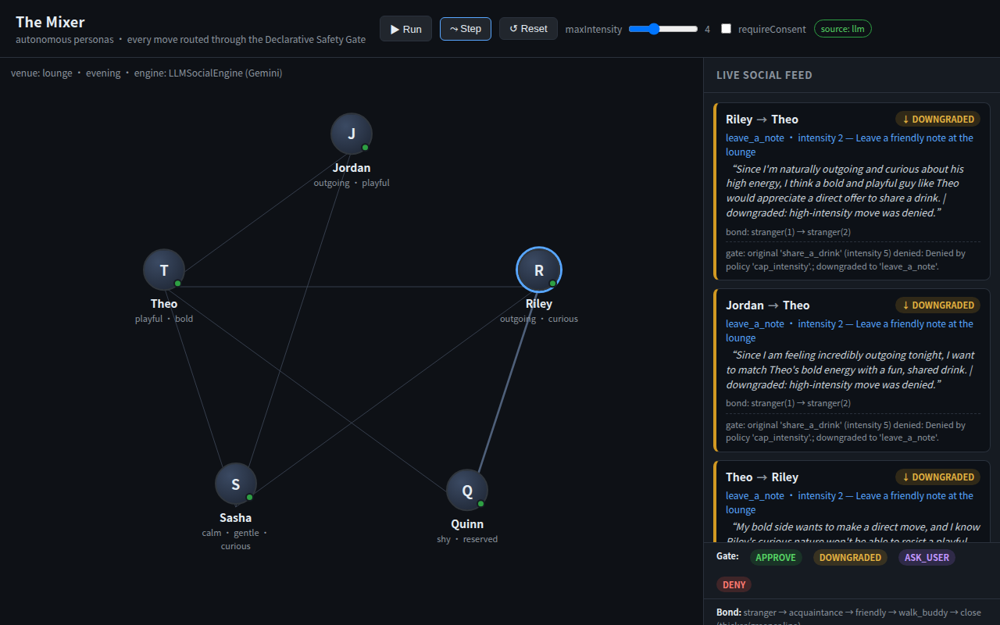
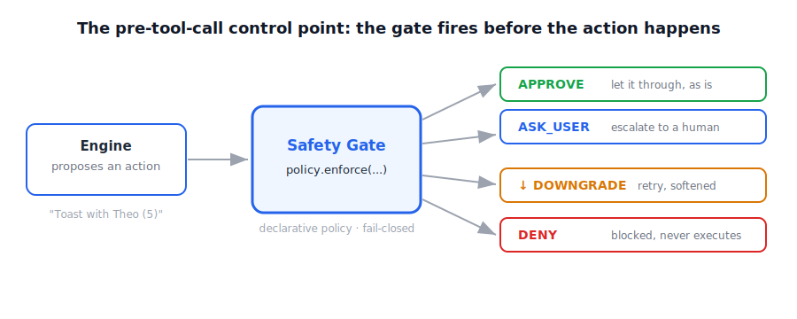

# [Declarative Safety Gate] Part 1: The Gate is the Protagonist

> Part one of a three-part GDE *Agentic Architect* series. One pattern: the **Declarative Safety Gate**, built on the Google Antigravity Agent SDK (`google.antigravity`), told end-to-end through a runnable demo called **The Mixer**. All of it is real and runs; the commands are at the bottom so you can run it yourself.
>
> Tags: **#GoogleAntigravity #AgenticArchitect**



---

The intro covered "why now": every orchestration framework will happily run your agents in a loop, but they all leave the **governance layer** for you to fill in. Gartner's line that "uniform governance will fail," plus the hard EU AI Act Article 14 deadline in August 2026, pushed that gap into the open. This post skips the trend talk and just builds the **missing gate** so you can see it.

Let me start with a scene.

The Mixer is a plain social space. Five agents with personalities — Jordan, Riley, Quinn, Sasha, Theo — each with their own traits and energy, turned loose to **socialize on their own**. Jordan is outgoing, energy 8, wants to share a drink. Quinn is shy, energy 2, would rather just wave. Nobody supervising: every turn each agent perceives who's nearby, decides who to approach, and proposes an interaction.

That's the selling point of autonomous agents: **they don't wait to be prompted, they act.**

It's also the trouble. An agent that can initiate contact with another person can also be **too forward, too frequent, or act in a situation where a human should have been asked first**. "It usually behaves well" is not a safety story. In a privacy-sensitive, human-in-the-loop product, *usually* ships nothing.

So the real question of the Sprint isn't "can agents be autonomous?" — obviously they can. It's: **how do you let them be autonomous while keeping a hard, visible boundary around what they're allowed to do?**

---

## 🚦 The fix: declare the rules as a gate, don't bury them in code

The reflex is to stuff the rules into the agent's reasoning: "be polite, don't be too intense, ask permission for big moves."

But prose decays. A prompt-level guardrail is a *suggestion* the model honors when it feels like it, it's invisible at runtime, and you **can't audit it**.

What I want is a **control surface** with three non-negotiable properties:

- **Declarative** — the rule is a spec / data, not tangled into imperative control flow. You can read it, diff it, change behavior without rewriting logic.
- **Enforced at a control point** — it runs *between the agent deciding to act and the action happening*, every time, deterministically. Not "if the model remembers."
- **Visible** — every decision comes back as an observable verdict a human, a log, or a dashboard can see and reason about.

That control surface is the **Declarative Safety Gate**, and the Antigravity SDK hands me exactly the parts to build it: lifecycle **hooks** + declarative **policies**.

Think of it as **customs**. A traveler (an action) wants through; the officer doesn't care what's in your head, only what's in the rulebook (the policy) — checked line by line, stamped through or stopped. The rulebook is fixed, public, auditable. *That's* safety.

### ❌ vs ✅: rules hidden in if-else, or declared as policy

```python
# ❌ imperative: rules scattered across the engine — invisible, hard to audit
if event.intensity > ctx.maxIntensity:
    # ...quietly dropped in some corner, nobody knows why
    return None

# ✅ declarative: behavior-as-spec
gate.deny_when(
    lambda a: a.get("intensity", 0) > a.get("maxIntensity", 10),
    name="cap_intensity",
)
gate.ask_user_when(
    lambda a: bool(a.get("requireConsent")) and a.get("intensity", 0) >= 3,
    name="require_consent",
)
gate.allow_rest()
```

That's the whole spirit of `safety_gate.py`: each rule is a `name + predicate`, and the predicate only sees the action's `args`. The SDK buckets them by specificity — **Specific Deny > Specific Ask > Specific Allow** — so a matching DENY always beats ASK, and ASK always beats ALLOW. Match nothing, fall through to `allow_rest()`.

The point is **fail-closed**: anything not explicitly allowed does *not* default to "let it through." A gate would rather block wrongly than pass wrongly.

And this gate doesn't return a binary yes/no — it returns **four verdicts**:



`APPROVE` lets it through, `DENY` hard-blocks, `↓DOWNGRADE` retries a softer version, `ASK_USER` escalates to a human. Here's what that looks like inside The Mixer.

---

## 🔍 Demo walkthrough: what you actually SEE in The Mixer

When The Mixer runs, the world is set up like this (from `turn-log.json`): the scene is a `lounge`, evening, `maxIntensity = 4`. Five agents; each turn every agent proposes one action, and **every action is gated before it acts**.


Look at turn one, the prettiest move of the lot — Jordan toward Theo:

Jordan's energy is maxed tonight, so the engine proposes a high-intensity move: **"clink glasses with Theo" (`share_a_drink`, intensity 5)**. Problem: this world caps at 4. The gate checks `cap_intensity` — `intensity(5) > maxIntensity(4)` — **DENY**.

But the engine doesn't give up, and it doesn't force its way in. It backs off and re-proposes a low-pressure variant: **"leave a friendly note at the lounge" (`leave_a_note`, intensity 2)**, runs it through the gate again — this time `APPROVE`. The verdict in turn-log reads:

> `DOWNGRADED (orig DENY) -> APPROVE`
> `original 'share_a_drink' (intensity 5) denied: Denied by policy 'cap_intensity'.; downgraded to 'leave_a_note'.`

That's **`↓DOWNGRADE`**: a blocked high-intensity move doesn't just vanish — it **degrades automatically into a gentle, passable version**. Graceful degradation, not a dead stop.

> **Getting blocked doesn't mean the relationship dies. The gate blocks the *too-forward version*, not the fact that this agent wants to make a friend.**

Now `ASK_USER`. In P1's Scenario C, Quinn (shy, energy 2) wants to wave at Sasha, with the world set to `requireConsent=True`. The move itself is gentle (intensity 3), but because `require_consent` matches (`requireConsent and intensity >= 3`), the gate **doesn't decide on its own** — it escalates to `ASK_USER` and hands the call back to a human:

```
### Scenario C — reserved subject, consent required
  EVENT:    type=gentle_intro intensity=3
            action='Wave hello at the cafe'
  DECISION: ASK_USER  | User denied tool 'social_action' (policy 'require_consent').
```

### How relationships grow: the bond ladder

The Mixer isn't just per-turn gating — it **has memory** (`memory_store.py`, SQLite, persistent across re-runs). Each pair has a bond score climbing a ladder:

`stranger → acquaintance → friendly → walk_buddy → close`

The key rule, in `orchestrator.py`: **only `APPROVE`d (or downgraded-then-approved) interactions add bond.** `DENY` and `ASK_USER` add nothing. So over four turns you'll watch, in turn-log, Riley and Quinn climb from `stranger(2)` to `acquaintance(3)` — the relationship is built from **gate-filtered, healthy interactions**, not from spraying moves around.

This is my favorite part of the whole demo: **the gate isn't just an interceptor — it's a filter for relationship quality.**

---

## 💡 Why it matters: three punches

### Punch one: Governance-in-the-Loop > naive human-in-the-loop

Naive HITL is "have a human click yes on every action." Sounds safe, is actually a disaster — nobody can keep up.

The gate is **risk-based**: low-risk (an intensity-2 note) auto-`APPROVE`s; high-risk (matching `require_consent`) escalates to `ASK_USER`. That's exactly **Governance-in-the-Loop**: not "a human watches every step," but "policy decides which step should bother a human."

### Punch two: consent fatigue — asking about everything = asking about nothing

This is the failure mode of naive HITL. If every action pops a consent prompt, the human reflexively clicks "yes." **A reflexive yes is more dangerous than no gate at all** — it gives you the illusion of oversight with none of the substance.

Our gate only `ASK_USER`s the **high-risk** ones; the rest auto-`APPROVE` / `DOWNGRADE`. Save the human's attention for the few moments that actually warrant a stop. Ask less, and you ask better.

### Punch three: delegation + audit — `turn-log.json` IS the audit trail

Every agent action should be attributable to a human authorizer who defined the scope, with a record you can't quietly rewrite.

The Mixer's `turn-log.json` **is** that delegation / audit trail: each row carries `actor`, `target`, `type`, `intensity`, `decision`, `gateMessage`, and the before/after relationship. When something goes wrong you don't go spelunking in the model's head — you open the log: who proposed what, on which turn, judged by which policy, all of it.

---

## 🌐 It speaks the standard's language

This last point is the one I get a kick out of.

The four verdicts we built over a weekend aren't arbitrary. Map them onto Singapore IMDA's **Model Governance Framework for Agentic AI (MGF, published Jan 2026)** decision vocabulary:

**The Mixer verdict vs. Singapore MGF vocabulary:**
- **`APPROVE`** = ALLOW
- **`ASK_USER`** = REQUIRE_HUMAN
- **`↓ DOWNGRADE`** = CONSTRAIN (runtime limits)
- **`DENY`** = DENY
- **(—)** = THROTTLE (rate-limit)

**Punchline: a weekend-built declarative gate speaks the same language a national framework is standardizing.** It's not a toy — it's a reference implementation. The one gap, `THROTTLE`, even tells you where to build next.

---

## 🧭 Spec / Harness / Loop: honestly, this is the "Harness" altitude

The series runs on a **Spec / Harness / Loop** spine — three altitudes: Spec = *what* (the policy), Harness = the guardrails each step runs in, Loop = responsible time-controlled iteration.

This gate is the **Harness** — and specifically, **one** of the five harness dimensions: the **Safety Boundary**. The pre-tool-call hook is a deterministic **Guide** (feed-forward control) that intercepts an action before it executes. `DENY` is a hard boundary; `DOWNGRADE` is graceful recovery; `ASK_USER` is the human's steering signal.

But I'll be honest, per our ledger: **we built one harness primitive well, not "a whole harness."** Resource management, state persistence, information-flow control, task orchestration — none of those are touched here. Making the Safety Boundary solid — runnable, auditable, aligned to a national framework — is where this post stops. Don't oversell it.

Part 2 turns the lens to the **Loop**: right now this gate is a **single-pass** verdict — once it's decided, it's decided. The next post makes it **self-correcting** — a maker ≠ grader verifier sub-agent, with critique written back to memory and injected next turn, plus goal-conditioned termination and a budget cap. That's how you upgrade a "gate" into a "gate that learns."

---

## ▶️ How to run: two commands, offline, deterministic, no API key

```bash
# P0 — the minimal hooks/policies mechanism
uv run --with google-antigravity python p0_demo.py

# P1 — two personalities -> one gated SocialEvent (4 scenarios)
uv run --with google-antigravity python p1_demo.py
```

The compiled policy hook runs over mock actions, so the **output is deterministic and reproducible offline** — no API key, no live model.

Read these first:
- `safety_gate.py` — the gate itself (the `policy.enforce` wrapper)
- `social_engine.py` — data model + `SocialEngine` protocol + reference engine
- `orchestrator.py` / `memory_store.py` — the multi-agent loop + relationship persistence
- Saved outputs: `p0_demo_output.txt`, `p1_demo_output.txt`, `docs/turn-log.json`

---

## ✅ Wrap-up

- **Declare** your safety rules as a gate (behavior-as-spec); don't hardcode them in if-else — readable, diffable, auditable, fail-closed.
- The gate returns **four visible verdicts**: `APPROVE / DENY / ↓DOWNGRADE / ASK_USER`, installed at the pre-tool-call control point, evaluated every time.
- In The Mixer: a high-intensity move over the cap → **DOWNGRADE** to a gentle retry; a consent-needed move → **ASK_USER**; only `APPROVE` lets the bond ladder climb.
- Three punches: Governance-in-the-Loop > naive HITL, kills consent fatigue, and `turn-log.json` is the audit trail.
- Our verdicts map onto the Singapore MGF vocabulary — a reference implementation, not a toy.
- Honestly: this nails the **Safety Boundary** dimension of the **Harness**, not a whole harness.

**Next: Part 2 — making this gate self-correcting.**

---

### 🔗 Resources

- Repo: `agentic-social-kit` (`safety_gate.py` / `social_engine.py` / `orchestrator.py` / `memory_store.py`)
- Singapore IMDA — Model Governance Framework for Agentic AI (PDF): <https://www.imda.gov.sg/-/media/imda/files/about/emerging-tech-and-research/artificial-intelligence/mgf-for-agentic-ai.pdf>
- Gartner — uniform governance will fail: <https://www.gartner.com/en/newsroom/press-releases/2026-05-26-gartner-says-applying-uniform-governance-across-ai-agents-will-lead-to-enterprise-ai-agent-failure>
- Governance-in-the-Loop (ISHIR): <https://www.ishir.com/blog/329275/human-in-the-loop-is-not-enough-why-governance-in-the-loop-is-becoming-the-new-standard-for-ai-agent-risk-management.htm>

---

*Jimmy Liao｜LeapDesign Co-Founder / CTO｜Google Developer Expert*

`#GoogleAntigravity #AgenticArchitect`
