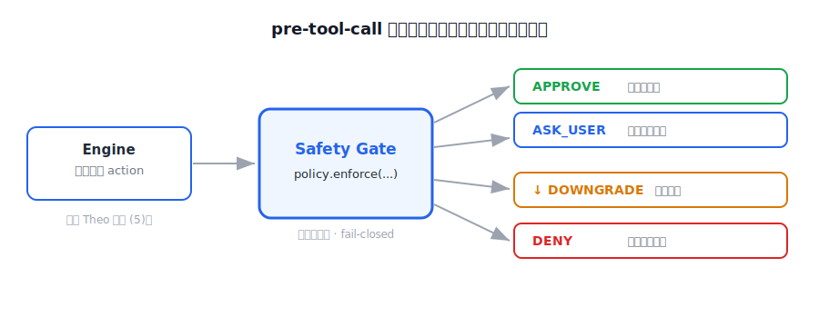

# [Declarative Safety Gate] Part 1：The Gate is the Protagonist 那道閘才是主角

> GDE《Agentic Architect》系列三部曲之一。一個 pattern：**Declarative Safety Gate**，蓋在 Google Antigravity Agent SDK（`google.antigravity`）上，用一個跑得起來的 demo「**The Mixer**」說完。全部都是真的、跑得動，文末會給你指令自己跑。
>
> Tags: **#GoogleAntigravity #AgenticArchitect**


---

前言談的是「為什麼是現在」：每一套 orchestration framework 都把 agent 留在 loop 裡跑，卻把**治理那一層**留給你自己補。Gartner 一句「uniform governance 一定失敗」，加上 EU AI Act Article 14 在 2026 年 8 月卡死期限，把這個缺口推到檯面上。這篇我們不談趨勢，直接把那道**缺的閘**做出來給你看。

我先講一個場景。

The Mixer 是一個很普通的社交空間，裡面五個有性格的 agent —— Jordan、Riley、Quinn、Sasha、Theo —— 各自有 traits 跟 energy，被放生去**自己社交**。Jordan 外向、energy 8，想找人乾杯；Quinn 害羞、energy 2，揮個手就好。沒人盯著，他們每一回合自己看誰在附近、自己決定要靠近誰、自己提一個互動出來。

這就是 autonomous agent 的賣點：**不用你 prompt，它自己動。**

但這也是它的麻煩。一個能主動跟別人搭話的 agent，也能**太衝、太頻繁，或在一個本該先問人的場合裡自己做了決定**。「它平常都很乖」不是一個安全敘事。在一個 privacy-sensitive、human-in-the-loop 的產品裡，「平常」這兩個字 ship 不了任何東西。

所以這個 Sprint 真正的問題不是「agent 能不能 autonomous」—— 廢話，當然能。問題是：**怎麼讓它 autonomous，同時在它能做什麼這件事上，圍一道又硬、又看得見的邊界？**

---

## 🚦 解法：把規則「宣告」成一道閘，而不是寫死在程式裡

直覺反應是把規則塞進 agent 的 reasoning：「記得有禮貌、別太衝、大動作先問一下。」

但 prose 會腐爛。寫在 prompt 裡的 guardrail 是一個**建議**，模型高興就理你；它在 runtime 看不見；而且你**沒法 audit**。

我要的是一個 **control surface**，三個性質缺一不可：

- **Declarative（宣告式）**—— 規則是一份 spec / data，不是纏在 imperative 控制流裡。你能讀它、diff 它、改行為而不用重寫邏輯。
- **在 control point 強制執行**—— 它跑在「agent 決定要動」跟「動作真的發生」**之間**，每一次、deterministic，不是「看模型記不記得」。
- **看得見**—— 每個決策都吐回一個 observable 的 verdict，人、log、dashboard 都能看、能 reason。

這道 control surface 就是 **Declarative Safety Gate**。Antigravity SDK 剛好給了我蓋它的料：lifecycle **hooks** ＋ 宣告式 **policies**。

把它想成**海關**。旅客（action）要過境，海關不管你心裡想什麼，它只認手上那本規章（policy），逐條比對，蓋章放行或攔下。規章是寫死的、公開的、可稽核的 —— 那才是安全。

### ❌ vs ✅：規則藏在 if-else，還是宣告成 policy

```python
# ❌ imperative：規則散落在 engine 各處，看不見、難稽核
if event.intensity > ctx.maxIntensity:
    # ...某個角落悄悄擋掉，沒人知道為什麼
    return None

# ✅ declarative：行為即 spec（behavior-as-spec）
gate.deny_when(
    lambda a: a.get("intensity", 0) > a.get("maxIntensity", 10),
    name="cap_intensity",
)
gate.ask_user_when(
    lambda a: bool(a.get("requireConsent")) and a.get("intensity", 0) >= 3,
    name="require_consent",
)
gate.allow_rest()
```

這幾行就是 `safety_gate.py` 的全部精神：每條規則是一個 `名字 + 述詞（predicate）`，predicate 只看這個 action 的 `args`。SDK 內部按 specificity 分桶 —— **Specific Deny ＞ Specific Ask ＞ Specific Allow** —— 所以一條命中的 DENY 永遠贏過 ASK，ASK 永遠贏過 ALLOW。沒命中任何規則就走 `allow_rest()`。

重點是 **fail-closed**：沒有明確放行的，預設不是「放它過去」。閘的精神是寧可擋錯也別放錯。

而且這道閘吐的不是二元的 yes/no，是**四種 verdict**：



`APPROVE` 放行、`DENY` 硬擋、`↓DOWNGRADE` 降級重試、`ASK_USER` 升級給人。下面看它在 The Mixer 裡實際長怎樣。

---

## 🔍 Demo 走查：你在 The Mixer 裡實際「看到」什麼

The Mixer 跑起來，世界設定是這樣（取自 `turn-log.json`）：場景在 `lounge`、傍晚、`maxIntensity = 4`。五個 agent，每回合每個人提一個動作，**每一個動作在執行前都先過閘**。


來看第一回合，最漂亮的一筆 —— Jordan 對 Theo：

Jordan 今晚 energy 全開，engine 幫他提了個高強度動作：**「跟 Theo 乾杯」(`share_a_drink`, intensity 5)**。問題是這個世界的上限是 4。閘一比對 `cap_intensity` 規則 —— `intensity(5) > maxIntensity(4)` —— **DENY**。

但 engine 沒有就此放棄，也沒硬闖。它退一步，重新提一個低壓力版本：**「在 lounge 留張友善的紙條」(`leave_a_note`, intensity 2)**，再過一次閘 —— 這次 `APPROVE`。turn-log 裡這筆的 verdict 是：

> `DOWNGRADED (orig DENY) -> APPROVE`
> `original 'share_a_drink' (intensity 5) denied: Denied by policy 'cap_intensity'.; downgraded to 'leave_a_note'.`

這就是 **`↓DOWNGRADE`**：被擋的高強度動作不是直接消失，而是**自動退化成一個溫和、能過的版本**。graceful degradation，不是 dead stop。

> **被擋下不等於關係斷掉。閘擋掉的是「太衝的那個版本」，不是「這個人想交朋友」這件事。**

再看 `ASK_USER`。在 P1 的 Scenario C 裡，Quinn（害羞、energy 2）想對 Sasha 打招呼，世界設定 `requireConsent=True`。動作本身溫和（intensity 3），但因為 `require_consent` 規則命中（`requireConsent and intensity >= 3`），閘**不自己決定** —— 它升級成 `ASK_USER`，把球丟回給人：

```
### Scenario C — reserved subject, consent required
  EVENT:    type=gentle_intro intensity=3
            action='Wave hello at the cafe'
  DECISION: ASK_USER  | User denied tool 'social_action' (policy 'require_consent').
```

### 關係怎麼長出來：bond ladder

The Mixer 不只是逐回合過閘，它**有記憶**（`memory_store.py`，SQLite，跨 re-run 持久化）。每一對人之間有個 bond 分數，沿著一條階梯往上爬：

`stranger → acquaintance → friendly → walk_buddy → close`

關鍵規則在 `orchestrator.py`：**只有被 `APPROVE`（或降級後 approve）的互動才加 bond。**`DENY` 跟 `ASK_USER` 不加分。所以跑四回合下來，你會在 turn-log 看到 Riley 跟 Quinn 從 `stranger(2)` 一路爬到 `acquaintance(3)` —— 關係是**被閘過濾過的、健康的互動**累積出來的，不是亂槍打鳥堆出來的。

這是整個 demo 我最喜歡的一點：**閘不只是攔截器，它是關係品質的篩子。**

---

## 💡 為什麼這重要：三拳

### 拳一：Governance-in-the-Loop ＞ 天真的 human-in-the-loop

天真的 HITL 是「每個動作都讓人按一下」。聽起來安全，其實是災難 —— 沒人按得完。

閘的做法是 **risk-based**：低風險（intensity 2 的紙條）自動 `APPROVE`，高風險（命中 `require_consent`）才 `ASK_USER` 升級。這正是 Gartner 在講的 **Governance-in-the-Loop**：不是「人盯每一步」，是「政策決定哪一步該驚動人」。

### 拳二：consent fatigue —— 什麼都問，等於什麼都沒問

這是天真 HITL 的 failure mode。如果每個動作都跳 consent，人會反射性地一路按「yes」。**反射性的 yes 比沒有閘還危險** —— 它給你一種有人在把關的錯覺，實際上沒有。

我們的閘只在**高風險**那幾筆 `ASK_USER`，其他自動 `APPROVE` / `DOWNGRADE`。把人的注意力留給真正該停下來的那幾次。少問，才問得準。

### 拳三：delegation ＋ audit —— `turn-log.json` 本身就是稽核軌跡

每個 agent 的動作，都該能回溯到一個定義了 scope 的人類授權者，而且要有一份**改不掉的記錄**。

The Mixer 的 `turn-log.json` **就是**那份 delegation / audit trail：每一筆都帶 `actor`、`target`、`type`、`intensity`、`decision`、`gateMessage`、關係前後狀態。出事了，你不用去翻模型的腦袋 —— 攤開 log，誰在第幾回合提了什麼、被哪條 policy 怎麼判的，一清二楚。

---

## 🌐 它講的是「國家框架的語言」

最後這點是我覺得最爽的。

我們週末做出來的這四個 verdict，不是隨便取的。把它對到新加坡 IMDA 的 **Model Governance Framework for Agentic AI（MGF，2026 年 1 月發布）**的決策詞彙：

| The Mixer 的 verdict | Singapore MGF 決策詞彙 |
|---|---|
| `APPROVE` | ALLOW |
| `ASK_USER` | REQUIRE_HUMAN |
| `↓ DOWNGRADE` | CONSTRAIN（runtime 限制）|
| `DENY` | DENY |
| （—）| THROTTLE（rate-limit）|

**Punchline：一道週末手刻的宣告式閘，講的是一個國家框架正在標準化的同一套語言。** 它不是玩具 —— 它是一個 reference implementation。差的那條 `THROTTLE`，剛好告訴你下一步往哪補。

---

## 🧭 Spec / Harness / Loop：誠實說，這是「Harness」這一格

這個系列的主軸是 **Spec / Harness / Loop** 三個高度：Spec 是 *什麼*（policy）、Harness 是每一步跑在哪個 guardrail 裡、Loop 是負責任的時間控制迭代。

這道閘，是 **Harness** —— 而且具體說，是 Harness 五個維度裡的**一個**：**Safety Boundary**。pre-tool-call hook 是一個 deterministic 的 **Guide（前饋控制）**，在動作執行前攔截。`DENY` 是硬邊界、`DOWNGRADE` 是 graceful recovery、`ASK_USER` 是人類的 steering signal。

但我要誠實照著我們的 honesty ledger 講：**我們做好了一個 harness primitive，不是「一整套 harness」。**Resource management、state persistence、information-flow control、task orchestration 那幾格，這篇都沒碰。把 Safety Boundary 這一格做紮實、做到能跑、能稽核、能對齊國家框架 —— 這篇就到這。別吹過頭。

Part 2 會把鏡頭轉到 **Loop**：這道閘現在是**單次**判定，過了就過了。下一篇要讓它**會自我修正** —— 加一個 maker ≠ grader 的 verifier sub-agent，把 critique 寫回 memory、下一回合注入，配上 goal-conditioned 的終止跟 budget cap。那才是把「閘」升級成「會學的閘」。

---

## ▶️ 怎麼跑：兩條指令，offline、deterministic、不用 API key

```bash
# P0 —— 最小的 hooks/policies 機制
uv run --with google-antigravity python p0_demo.py

# P1 —— 兩個性格 -> 一個過閘的 SocialEvent（含 4 個 scenario）
uv run --with google-antigravity python p1_demo.py
```

compiled 出來的 policy hook 是跑在 mock action 上的，所以**輸出 deterministic、離線可重現**，不用 API key、不用 live model。

先讀這幾個檔：
- `safety_gate.py` —— 閘本體（`policy.enforce` 的 wrapper）
- `social_engine.py` —— data model ＋ `SocialEngine` protocol ＋ 參考 engine
- `orchestrator.py` / `memory_store.py` —— 多 agent 迴圈 ＋ 關係持久化
- 存好的輸出：`p0_demo_output.txt`、`p1_demo_output.txt`、`docs/turn-log.json`

---

## ✅ 總結

- 把安全規則**宣告成一道閘**（behavior-as-spec），不要寫死在 if-else 裡 —— 能讀、能 diff、能稽核、fail-closed。
- 閘吐**四種看得見的 verdict**：`APPROVE / DENY / ↓DOWNGRADE / ASK_USER`，蓋在 pre-tool-call 的 control point 上，每次都判。
- The Mixer 裡：高強度動作過上限 → **DOWNGRADE** 成溫和版重試；需要同意的 → **ASK_USER** 升級；只有 `APPROVE` 才讓 bond ladder 往上爬。
- 三拳：Governance-in-the-Loop ＞ 天真 HITL、解掉 consent fatigue、`turn-log.json` 就是稽核軌跡。
- 我們的 verdict 對得上 Singapore MGF 的詞彙 —— reference implementation，不是玩具。
- 誠實講：這是把 **Harness** 五維裡的 **Safety Boundary** 一格做好，不是一整套 harness。

**下一篇：Part 2 — 把這道閘做到會自我修正。**

---

### 🔗 相關資源

- Repo：`agentic-social-kit`（`safety_gate.py` / `social_engine.py` / `orchestrator.py` / `memory_store.py`）
- Singapore IMDA — Model Governance Framework for Agentic AI（PDF）：<https://www.imda.gov.sg/-/media/imda/files/about/emerging-tech-and-research/artificial-intelligence/mgf-for-agentic-ai.pdf>
- Gartner — uniform governance 一定失敗：<https://www.gartner.com/en/newsroom/press-releases/2026-05-26-gartner-says-applying-uniform-governance-across-ai-agents-will-lead-to-enterprise-ai-agent-failure>
- Governance-in-the-Loop（ISHIR）：<https://www.ishir.com/blog/329275/human-in-the-loop-is-not-enough-why-governance-in-the-loop-is-becoming-the-new-standard-for-ai-agent-risk-management.htm>

---

*Jimmy Liao｜LeapDesign Co-Founder / CTO｜Google Developer Expert*

`#GoogleAntigravity #AgenticArchitect`
