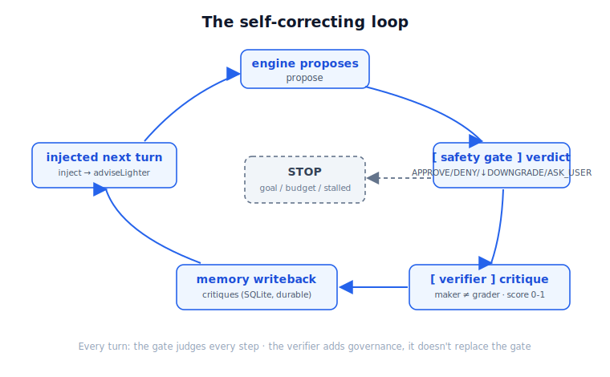

# [Declarative Safety Gate] Part 2: From a Shallow Gate to a Self-Correcting Loop

> The **finale** of the GDE *Agentic Architect* trilogy. The intro made the case for *why now*; Part 1 built the **Declarative Safety Gate** and showed it running. This post goes back and fills a hole I admitted out loud at the end of Part 1 — that gate decides once, and it doesn't learn. We're upgrading it into a **self-correcting loop**. Everything here is real and runnable; the commands are at the bottom.
>
> Tags: **#GoogleAntigravity #AgenticArchitect**



---

Let me pick up the honest line I left at the end of Part 1.

I wrote it down in black and white: that gate is a **single-pass evaluation**. The engine proposes an action, the gate decides `APPROVE / DENY / ↓DOWNGRADE / ASK_USER`, and that's it. **No independent verifier, no self-correction.** It governs well, but it never "does better next turn."

That's a **shallow loop**.

Shallow how? It has no time dimension. The gate blocks an over-eager move, and next turn the engine might propose the exact same over-eager thing — because **nobody recorded that the last one got blocked and fed it back**. The gate is a diligent customs officer who shows up to work with amnesia every day, never recognizing the traveler it turned away yesterday.

In Part 1 I called the gate the **Harness**: the joint where the rule fires. This post turns the camera to the **Loop**: the time-control flow that runs lap after lap, folds spec + harness into every lap, and — crucially — **knows when to STOP**.

So the whole arc of this post is one sentence:

**Shallow loop (gate decides once, done) → self-correcting loop (propose → gate → verify → write back to memory → next lap gets better).**

---

## 🧩 The fix: add three rings, don't touch the gate

I didn't change the gate. It's still the Part 1 gate, governing every step. I wrapped three rings **around** it:

- **An independent verifier sub-agent (maker ≠ grader)** — the one who proposes can't be the one who grades.
- **Critique written back to memory, injected next turn** — so "what we learned last time" actually shapes "what we propose this time."
- **Goal-conditioned termination + budget cap** — the loop doesn't run forever; it stops on goal or budget, and it tells you why.

One at a time.

### 🧪 maker ≠ grader is *structural*, not a claim

`verifier.py` holds a `Verifier` Protocol plus a deterministic, offline `RuleBasedVerifier` (same pattern as the engine's rule-based fallback). It returns a `Critique` dataclass: a `score ∈ [0,1]` and an actionable `advise_lighter` steer for the next turn.

The score weighs three things:

- **advance** — did the bond actually move up?
- **appropriate** — did the gate verdict match the pressure chosen? `DENY` / `ASK_USER` mean the engine **over-reached** (inappropriate); `DOWNGRADE` is a correct recovery (appropriate); a clean `APPROVE` is appropriate.
- **quality** — pair compatibility + a sensible intensity.

The point isn't how clever those three axes are. The point is **how it's walled off from the engine**:

> **The verifier sees only the outcome — the event, the gate's decision, the bond before/after. It shares no state with the engine. So maker ≠ grader is structural, not something I merely claim.**

This matters. Any system that grades itself carries self-validation bias — it finds reasons to let itself off the hook. Splitting the grader off from the proposer, and giving it only the outcome (never the engine's internals), is what blocks that bias at the structural level. This is exactly the **Sub-agents (independent verification)** component of loop engineering.

### 💾 Critique writeback + injection: giving the loop a memory

A score alone does nothing. It has to bend the next proposal.

`memory_store.py` gains a durable `critiques` SQLite table. `record_critique(...)` stores each one; then at the **top of each actor's next turn**, `latest_critique(actor)` reads it back and folds it into `EngineInput.adviseLighter` / `critiqueNote` — so the next proposal **self-corrects**.

And it's **durable**. The critique lands in SQLite just like relationships do, so the steer survives a re-run — like a real relationship, you don't forget yesterday's misstep just because you slept on it.

### ⏱️ Responsible termination: goal / budget / stalled, stated plainly

`SelfCorrectingSimulation` in `orchestrator.py` won't run unbounded. It stops on **whichever comes first**:

- **goal_reached** — any pair climbs to `walk_buddy`.
- **budget_engine_calls** — engine-call cap (default 60).
- **stalled** — 4 turns with no approved progress.
- **budget_turns** — turn cap (default 12).

On stop it prints `STOP: <kind> — <detail>`. A responsible loop doesn't just run — it **stops, and accounts for why**. That's what Resource Management (one of the harness dimensions) looks like at the loop layer.

---

## 🔍 The real walkthrough: self-correction in a single turn

This is the centerpiece. Let me walk you straight through the **Jordan → Theo** thread in `p4_demo_output.txt`.

World: `park`, afternoon, `maxIntensity = 4`. Jordan is energy 8, playful — a bold one.

**Turn 1** — Jordan proposes a bold `visit` (intensity 8). The gate hits `cap_intensity`: `8 > 4`, **DENY**, then auto-**DOWNGRADED** to `leave_a_note` (intensity 2), which passes. Then the verifier steps in to grade:

> `verifier (grader): score=0.87 advance=True appropriate=True | recovered via downgrade to 'leave_a_note'; bond advanced (+1)`

That critique carries `advise_lighter=True` and gets written back to memory. In plain English: **"You over-reached and got rescued by a downgrade — go gentler next time."**

**Turn 2** — Jordan injects that critique right at the top. The `<- injected critique` line in the output is exactly that:

```
[APPROVE   ] a_jordan -> a_theo: gentle_intro (intensity 3)
    <- injected critique : recovered via downgrade to 'leave_a_note'; bond advanced (+1)
    proposal rationale  : prior critique advised a gentler move; start light at the park.
    gate                : APPROVE (social_action)
```

Note the rationale — *"prior critique advised a gentler move."* This time Jordan doesn't propose `visit`; it proposes `gentle_intro` (intensity 3), **approved in one shot, zero downgrade**.

Side by side:

**Turn 1 (no memory):**
- **Proposal**: `visit`, intensity **8**
- **Gate verdict**: DENY → **↓DOWNGRADE**
- **Why**: over-reached, hit `cap_intensity`
- **Bond**: stranger(0) → stranger(1)

**Turn 2 (after injected critique):**
- **Proposal**: `gentle_intro`, intensity **3**
- **Gate verdict**: **APPROVE**
- **Why**: rationale: *prior critique advised a gentler move*
- **Bond**: stranger(2) → acquaintance(3)

**Self-correction, visible inside a single turn.** Not the statistical kind where you run it a hundred times and the average improves — this one proposal, and you can point at *why* it's better than the last.

Is there a counter-example? Yes, and it's important. The **Quinn → Sasha** thread: Quinn is shy, energy 2, the quiet one, and it **never over-reaches** — every turn it proposes `gentle_intro`, every turn it's `APPROVE`. The verifier gives it a steady `score≈0.88`.

That contrast is the real lesson:

> **The loop only changes behavior where the gate pushed back. The actor that was never blocked never gets "corrected" for no reason.** Self-correction isn't a machine that fiddles everywhere — it's a feedback that responds only to real friction.

Around turn 9, Jordan↔Theo reach `walk_buddy`, the goal is met, and the loop stops.

---

## 📊 A responsible loop puts the bill on the table

The last line the loop prints is something I deliberately surface — **what this lap actually cost**:

```
responsible loop engineering: engine_calls=45 verifier_calls=45 gate_evaluations=49 sim_tokens=8100
```

How to read it:

- `engine_calls=45` / `verifier_calls=45` — every proposal gets one independent review, one-to-one.
- `gate_evaluations=49` — 4 more than 45, because the **gate runs twice on downgrade turns** (first denies the original, then judges the downgraded version). Turn 1 had 4 downgrades — that's the extra 4.
- `sim_tokens=8100` — a mock tally of 120/proposal + 60/review.

Why print this? Because in a self-correcting loop, every extra verify lap is extra cost. **Autonomy isn't free; self-correction is even less free.** Putting engine / verifier / gate / token counts in the summary is what earns the word "responsible." Automation that hides its cost will eventually hand you a surprise on the invoice.

---

## 🧾 The honesty ledger: what this is, what it isn't

Part 1 had an honesty ledger; this one gets one too. "Self-correcting" sounds sexy, but I have to draw the boundary so you don't think I built something I didn't:

- **The verifier is rule-based and deterministic, NOT an LLM judge.** It doesn't "read context"; it scores by rules. An `LLMVerifier` is the natural next step — and **the seam is already there** (the `Verifier` Protocol exists precisely to swap it in).
- **`sim_tokens` is a mock estimate, not a real tokenizer count.** It demonstrates the *habit* of surfacing cost; don't take the number to accounting.
- **Injection uses the single latest critique per actor, not a full rolling Reflexion memory of N reflections.** And the rule engine currently acts only on `advise_lighter` (gentle vs bold); `critiqueNote` is carried along but only shows up in the output and rationale, not yet in the scoring.
- **There's no scheduled `triggers.every(...)` heartbeat yet.** The loop is driven synchronously — that "automation heartbeat" is still a **lens**, not a wired-up scheduler.

So what P4 adds over Part 1, in one line: **a sub-agent verifier + self-correcting feedback + responsible termination.** What it does *not* add: an LLM judge and a scheduled heartbeat — those are for later; the seams are left open.

I'd rather state this plainly than sell the illusion of a "fully autonomous agent that learns." Overselling Part 1 turns it into a fake harness; overselling Part 2 turns it into fake AGI. Neither, thanks.

---

## 🧭 Spec / Harness / Loop: closing the trilogy

At this point the three posts have walked the full arc of the thesis:

- **Intro = Why** — why this governance layer is needed (the Moltbook mirror, magnified 1.5M×).
- **Part 1 = Harness** — where the rule fires (the pre-tool-call gate).
- **Part 2 = Loop** — the time-control flow that runs lap after lap, folds spec + harness into each iteration, and **knows when to STOP**.

One thing I'll stress again, because it's easy to misread: **the gate governs every step the whole way through.** The verifier isn't there to replace it — it's **additional** governance (maker ≠ grader, quality / goal-fitness), layered on top of the gate, not swapped in for it. The gate is the hard safety boundary; the verifier is "beyond safe, was this step actually good." Two layers, distinct jobs.

> **Spec is *what* the rule is. Harness is *where* it fires. Loop is the whole thing running lap after lap — and knowing when to stop.**

---

## ▶️ How to run: one command, offline, deterministic, no API key

```bash
cd agentic-social-kit && uv run --with google-antigravity python p4_demo.py --reset
```

`--reset` wipes persisted memory before running. The whole loop is offline and deterministic — no API key, no live model.

Files to read first:

- `verifier.py` — the independent verifier (`Verifier` Protocol + `RuleBasedVerifier` + `Critique`).
- `p4_demo.py` — the entry point wiring engine (maker) and verifier (grader) into the loop.
- `memory_store.py` / `orchestrator.py` — critique writeback / injection, and `SelfCorrectingSimulation`'s termination + metrics.
- Saved output: `p4_demo_output.txt`.

---

## ✅ Wrap-up

- Part 1's gate was a **single-pass evaluation**; this post upgrades it into a **self-correcting loop**: propose → gate → verify → write back to memory → next lap gets better.
- Added a **maker ≠ grader independent verifier**: it sees only the outcome, shares no state with the engine, so the bias is blocked **structurally**, not by promise.
- Critique is **written back to SQLite and injected next turn**: after Jordan got rescued by a downgrade, the next turn it proposes a gentle `gentle_intro` that's approved in one shot — rationale literally reads *prior critique advised a gentler move*.
- The loop **stops responsibly**: one of `goal_reached` / `budget` / `stalled`, and it prints `engine_calls / verifier_calls / gate_evaluations / sim_tokens` to put the cost on the table.
- Honestly: the verifier is still rule-based (not an LLM judge), `sim_tokens` is a mock, injection uses only the latest single critique, and the heartbeat is a lens not a scheduler. Every seam is left open.
- Trilogy closed: Intro = Why, Part 1 = Harness, Part 2 = Loop. The gate governs every step throughout; the verifier is **additional** governance, not a replacement.

**This is the final post in the series.** The seams are sitting right there — swap `RuleBasedVerifier` for an `LLMVerifier` so it actually reads context, wire up a scheduled `triggers.every(...)` heartbeat, or reskin the same engine into a World Cup watch-party flare-up gate. All natural next stops. But that's another story.

Want to play with it? Repo's below. Swap the verifier, tune the budget, crank `maxIntensity` even lower to force the engine to over-reach and watch the critique rescue it — go try.

---

### 🔗 Resources

- Repo: `agentic-social-kit` (`verifier.py` / `p4_demo.py` / `memory_store.py` / `orchestrator.py` / `social_engine.py`)
- Saved output: `p4_demo_output.txt`
- Singapore IMDA — Model Governance Framework for Agentic AI (PDF): <https://www.imda.gov.sg/-/media/imda/files/about/emerging-tech-and-research/artificial-intelligence/mgf-for-agentic-ai.pdf>
- Gartner — uniform governance leads to failure: <https://www.gartner.com/en/newsroom/press-releases/2026-05-26-gartner-says-applying-uniform-governance-across-ai-agents-will-lead-to-enterprise-ai-agent-failure>
- Governance-in-the-Loop (ISHIR): <https://www.ishir.com/blog/329275/human-in-the-loop-is-not-enough-why-governance-in-the-loop-is-becoming-the-new-standard-for-ai-agent-risk-management.htm>

---

*Jimmy Liao｜LeapDesign Co-Founder / CTO｜Google Developer Expert*

`#GoogleAntigravity` `#AgenticArchitect`
