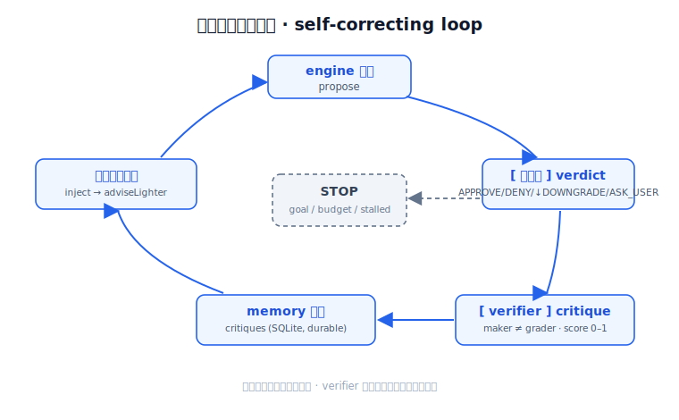

# Part 2 —〈把那道閘做到會自我修正 From a shallow gate to a self-correcting loop〉

> GDE《Agentic Architect》系列三部曲的**最後一篇**。前言講「為什麼是現在」，Part 1 把那道 **Declarative Safety Gate** 做出來給你看。這篇要回頭補上一個我在 Part 1 結尾自己招認的洞 —— 那道閘只判一次，不會學。我們要把它升級成一個**會自我修正的 loop**。全部都是真的、跑得動，文末給你指令自己跑。
>
> Tags: **#GoogleAntigravity #AgenticArchitect**



---

先承接 Part 1 結尾那句誠實話。

我在上一篇白紙黑字寫了：這道閘是一個**單次判定（single-pass evaluation）**。engine 提一個動作、閘判 `APPROVE / DENY / ↓DOWNGRADE / ASK_USER`，判完就結束。**沒有獨立的 verifier、沒有自我修正。** 它很會把關，但它不會「下一回合做得更好」。

這就是一道**淺 loop**。

淺在哪？淺在它沒有時間維度。閘擋掉一個太衝的動作，下一回合 engine 還是可能再提一次一樣衝的東西 —— 因為**沒有人把「剛剛那筆被擋了」這件事記下來、餵回去**。閘是個盡責的海關，但它每天上班都失憶，不認得昨天被它退件的那個人。

Part 1 我說那道閘是 **Harness**：規則開火的那個關節。這篇要把鏡頭轉到 **Loop**：那個一圈一圈跑、每一圈都把 spec 跟 harness 吃進去、而且**知道什麼時候該停**的時間控制流。

所以這篇的弧線只有一句：

**淺 loop（閘判一次就結束）→ 會自我修正的 loop（提案 → 閘 → 驗證 → 寫回記憶 → 下一輪變好）。**

---

## 🧩 解法：補三件東西，不動那道閘

我沒有去改閘。閘還是 Part 1 那道閘，照判每一步。我在它**外面**加了三圈：

- **一個獨立的 verifier sub-agent（maker ≠ grader）** —— 提案的人，不能是打分的人。
- **critique 寫回記憶、下一回合注入** —— 讓「上一筆學到的事」真的影響「這一筆的提案」。
- **goal-conditioned 終止 ＋ budget cap** —— loop 不是跑到天荒地老，是達標或燒完預算就停，而且交代為什麼停。

一個一個拆。

### 🧪 maker ≠ grader 是「結構上」做到的，不是嘴上說

`verifier.py` 裡是一個 `Verifier` Protocol，配一個 deterministic、offline 的 `RuleBasedVerifier`（跟 engine 那邊的 rule-based fallback 同一個 pattern）。它吐一個 `Critique` dataclass：一個 `score ∈ [0,1]`，外加一個 `advise_lighter` 的下一步轉向訊號。

score 看三件事：

- **advance** —— 這一筆有沒有真的把 bond 往上推？
- **appropriate** —— 閘的判決對不對得上動作的壓力？`DENY` / `ASK_USER` 代表 engine **衝過頭**了（inappropriate）；`DOWNGRADE` 是正確的 recovery（appropriate）；乾淨的 `APPROVE` 也是 appropriate。
- **quality** —— 這對人合不合得來、強度合不合理。

重點不在這三個軸多聰明，重點在**它怎麼跟 engine 隔開的**：

> **verifier 只看得到「結果」—— 事件、閘的判決、互動前後的 bond。它跟 engine 不共用任何 state。所以 maker ≠ grader 是結構性的，不是我嘴上講講。**

這很要緊。一個會自我打分的系統，永遠有 self-validation bias —— 它會給自己台階下。把打分的人從提案的人手上拆開、讓它只能看 outcome、看不到 engine 的內部，這個偏誤才被結構擋掉。這正是 loop engineering 講的 **Sub-agents（獨立驗證）**那一格。

### 💾 critique 寫回 ＋ 注入：讓 loop「記得」

光打分沒用，分數要能影響下一筆。

`memory_store.py` 多了一張 durable 的 `critiques` SQLite table。`record_critique(...)` 把每一筆 critique 存進去；然後每個 actor**下一回合一開頭**，`latest_critique(actor)` 把它讀回來，折進 `EngineInput` 的 `adviseLighter` / `critiqueNote` —— 於是下一個提案就**自我修正**了。

而且它是 **durable** 的。critique 跟關係一樣寫進 SQLite，re-run 之後那個轉向訊號還在 —— 就像現實裡的關係，你不會因為睡了一覺就忘記昨天踩到對方的雷。

### ⏱️ 負責任的終止：達標 / 燒完 / 卡住，講清楚

`orchestrator.py` 裡的 `SelfCorrectingSimulation` 不會無限跑。它跑到下面**哪個先發生**就停：

- **goal_reached** —— 任何一對關係爬到 `walk_buddy`。
- **budget_engine_calls** —— engine 呼叫上限（預設 60）。
- **stalled** —— 連續 4 回合沒有任何 approved 進展。
- **budget_turns** —— 回合上限（預設 12）。

停的時候印一行 `STOP: <kind> — <detail>`。一個負責任的 loop，不只要會跑，要**會停、而且交代為什麼停**。這就是 harness 五維裡 Resource Management 在 loop 層的長相。

---

## 🔍 真實走查：一個轉折，看 self-correction 當場發生

這是整篇的核心。我直接帶你看 `p4_demo_output.txt` 裡 **Jordan → Theo** 這條線。

世界設定：場景在 `park`、下午、`maxIntensity = 4`。Jordan 是個 energy 8、playful 的衝組。

**Turn 1** —— Jordan 提了一個大膽的 `visit`（intensity 8）。閘一比 `cap_intensity`：`8 > 4`，**DENY**，然後自動 **DOWNGRADED** 成 `leave_a_note`（intensity 2）過關。接著 verifier 進場打分：

> `verifier (grader): score=0.87 advance=True appropriate=True | recovered via downgrade to 'leave_a_note'; bond advanced (+1)`

critique 帶著 `advise_lighter=True` 寫回記憶。翻譯成人話：**「你剛剛衝過頭被降級救回來了，下一次溫和點。」**

**Turn 2** —— Jordan 一開頭就把這筆 critique 注入了。輸出裡那行 `<- injected critique` 就是它：

```
[APPROVE   ] a_jordan -> a_theo: gentle_intro (intensity 3)
    <- injected critique : recovered via downgrade to 'leave_a_note'; bond advanced (+1)
    proposal rationale  : prior critique advised a gentler move; start light at the park.
    gate                : APPROVE (social_action)
```

注意那句 rationale —— *"prior critique advised a gentler move"*。Jordan 這次不提 `visit` 了，改提 `gentle_intro`（intensity 3），**一次過關，零降級**。

把兩回合擺一起：

| | Turn 1（沒記憶） | Turn 2（注入 critique 後） |
|---|---|---|
| 提案 | `visit`，intensity **8** | `gentle_intro`，intensity **3** |
| 閘判決 | DENY → **↓DOWNGRADE** | **APPROVE** |
| 為什麼 | 衝過頭撞上 `cap_intensity` | rationale：*上一筆 critique 建議溫和點* |
| bond | stranger(0) → stranger(1) | stranger(2) → acquaintance(3) |

**一個回合之內，self-correction 看得見。** 不是「跑了一百次平均下來變好」那種統計式進步，是這一筆，你指得出它為什麼比上一筆好。

那有沒有反例？有，而且很重要。**Quinn → Sasha** 這條線，Quinn 是害羞、energy 2 的安靜組，它**從來沒衝過頭** —— 每一回合都提 `gentle_intro`、每一回合都 `APPROVE`。verifier 也一路給它 `score≈0.88`。

這個對照才是重點：

> **loop 只在「閘曾經回推過」的地方改變行為。沒被擋過的人，不會被無事生非地「修正」。** 自我修正不是一台到處亂改的機器，是一個只回應真實摩擦的回饋。

跑到大約 turn 9，Jordan↔Theo 爬到 `walk_buddy`，goal 達成，loop 停。

---

## 📊 負責任的 loop，要把帳攤開

loop 跑完印的最後一行，是我刻意要 surface 的東西 —— **這一圈到底花了多少**：

```
responsible loop engineering: engine_calls=45 verifier_calls=45 gate_evaluations=49 sim_tokens=8100
```

讀法：

- `engine_calls=45` / `verifier_calls=45` —— 每一步提案配一次獨立 review，一比一。
- `gate_evaluations=49` —— 比 45 多 4，因為**降級的那幾回合閘會跑兩次**（先判原案 DENY、再判降級版）。Turn 1 有 4 筆 downgrade，剛好多 4。
- `sim_tokens=8100` —— 提案 120 / 筆、review 60 / 筆的 mock 估算累加。

為什麼要印這個？因為一個會自我修正的 loop，每多一圈 verify 就是多一份成本。**autonomy 不是免費的；自我修正更不是。** 把 engine / verifier / gate / token 的帳攤在 summary 裡，才有資格叫「負責任」。藏起成本的自動化，遲早會在帳單上給你一個 surprise。

---

## 🧾 誠實帳本：這是什麼、不是什麼

Part 1 我有一張 honesty ledger，這篇照樣要有。會自我修正聽起來很性感，但我得把邊界講清楚，免得你以為我做了一個我沒做的東西：

- **verifier 是 rule-based、deterministic 的，不是 LLM judge。** 它不會「讀懂語境」，它按規則打分。一個 `LLMVerifier` 是很自然的下一步 —— 而且**那個接縫已經留好了**（`Verifier` Protocol 就是為了換它而存在）。
- **`sim_tokens` 是 mock 估算，不是真的 tokenizer 數出來的。** 它示範「該把成本攤出來」這個習慣，數字本身別拿去報帳。
- **注入用的是每個 actor 最新的「單一」critique，不是一整捲 N 筆反思的 Reflexion memory。** 而且 rule engine 現在只對 `advise_lighter`（溫和 vs 大膽）動作；`critiqueNote` 有被帶著走，但只出現在輸出跟 rationale 裡，還沒進到打分邏輯。
- **還沒有排程的 `triggers.every(...)` heartbeat。** 這個 loop 是同步驅動的 —— 那個「自動心跳」目前還是一面**鏡頭（lens）**，不是真的接上的 scheduler。

所以 P4 比 Part 1 多了什麼，講白就一句：**多了 sub-agent verifier ＋ 自我修正的 feedback ＋ 負責任的終止。** 沒多的是 LLM judge 跟排程心跳 —— 那是後話，接縫留著。

我寧可這樣講清楚，也不要賣一個「全自動會學的 agent」的幻覺。Part 1 賣過頭會變成假 harness，Part 2 賣過頭會變成假 AGI。都不要。

---

## 🧭 Spec / Harness / Loop：三部曲收束

到這裡，三篇剛好把主軸的三個高度走完一圈：

- **〈前言〉= Why** —— 為什麼需要這道治理層（Moltbook 那面 150 萬倍的鏡子）。
- **Part 1 = Harness** —— 規則在哪個關節開火（pre-tool-call 的那道閘）。
- **Part 2 = Loop** —— 那個一圈圈跑、每一輪把 spec ＋ harness 吃進去、而且**知道何時該 STOP** 的時間控制流。

有一件事我要再強調一次，因為很容易被誤會：**那道閘從頭到尾都還在管每一步。** verifier 不是來取代閘的 —— 它是**額外的**治理（maker ≠ grader 的品質 / 目標適配），疊在閘上面，不是換掉閘。閘是硬安全邊界，verifier 是「這一步除了安全，做得好不好」。兩層各司其職。

> **Spec 是規則是什麼。Harness 是規則在哪開火。Loop 是這一切一圈圈跑、而且知道何時收手。**

---

## ▶️ 怎麼跑：一條指令，offline、deterministic、不用 API key

```bash
cd agentic-social-kit && uv run --with google-antigravity python p4_demo.py --reset
```

`--reset` 會先清掉 persisted memory 再跑。整個 loop offline、deterministic，不用 API key、不用 live model。

先讀這幾個檔：

- `verifier.py` —— 獨立 verifier（`Verifier` Protocol ＋ `RuleBasedVerifier` ＋ `Critique`）。
- `p4_demo.py` —— 把 engine（maker）跟 verifier（grader）接起來跑 loop 的入口。
- `memory_store.py` / `orchestrator.py` —— critique 寫回 / 注入、`SelfCorrectingSimulation` 的終止 ＋ metrics。
- 存好的輸出：`p4_demo_output.txt`。

---

## ✅ 總結

- Part 1 的閘是**單次判定**；這篇把它升級成**會自我修正的 loop**：提案 → 閘 → 驗證 → 寫回記憶 → 下一輪變好。
- 加了一個 **maker ≠ grader 的獨立 verifier**：它只看 outcome、跟 engine 不共用 state，所以偏誤是被**結構**擋掉的，不是嘴上保證的。
- critique **寫回 SQLite、下一回合注入**：Jordan 被降級救回後，下一回合主動提溫和版 `gentle_intro` 一次過關 —— rationale 直接寫著 *prior critique advised a gentler move*。
- loop **負責任地停**：`goal_reached` / `budget` / `stalled` 擇一，並印出 `engine_calls / verifier_calls / gate_evaluations / sim_tokens` 把成本攤開。
- 誠實講：verifier 還是 rule-based（不是 LLM judge）、`sim_tokens` 是 mock、注入只用最新單筆 critique、heartbeat 還是 lens 不是 scheduler。接縫都留好了。
- 三部曲收束：前言 = Why、Part 1 = Harness、Part 2 = Loop。閘一直都在管每一步，verifier 是**額外**治理，不是替代。

**這是系列最後一篇。** 接縫已經留在那 —— 把 `RuleBasedVerifier` 換成 `LLMVerifier` 讓它真的讀懂語境、接上排程的 `triggers.every(...)` heartbeat、或者把同一個引擎換個皮變成世界盃看球室的防爆機制，都是很自然的下一站。但那是另一個故事了。

想自己玩，repo 在下面。換個 verifier、調個 budget、把 `maxIntensity` 壓更低逼 engine 衝過頭看 critique 怎麼救它回來 —— 都試試看。

---

### 🔗 相關資源

- Repo：`agentic-social-kit`（`verifier.py` / `p4_demo.py` / `memory_store.py` / `orchestrator.py` / `social_engine.py`）
- 存好的輸出：`p4_demo_output.txt`
- Singapore IMDA — Model Governance Framework for Agentic AI（PDF）：<https://www.imda.gov.sg/-/media/imda/files/about/emerging-tech-and-research/artificial-intelligence/mgf-for-agentic-ai.pdf>
- Gartner — uniform governance 一定失敗：<https://www.gartner.com/en/newsroom/press-releases/2026-05-26-gartner-says-applying-uniform-governance-across-ai-agents-will-lead-to-enterprise-ai-agent-failure>
- Governance-in-the-Loop（ISHIR）：<https://www.ishir.com/blog/329275/human-in-the-loop-is-not-enough-why-governance-in-the-loop-is-becoming-the-new-standard-for-ai-agent-risk-management.htm>

---

*Jimmy Liao｜LeapDesign Co-Founder / CTO｜Google Developer Expert*

`#GoogleAntigravity` `#AgenticArchitect`
